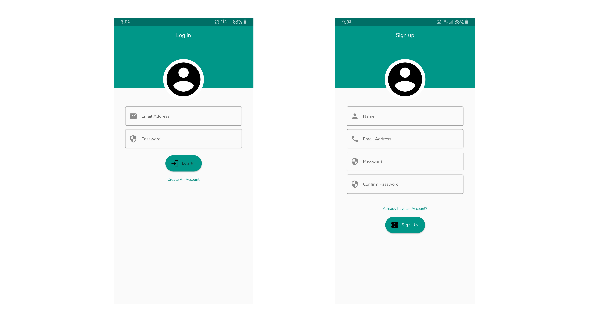
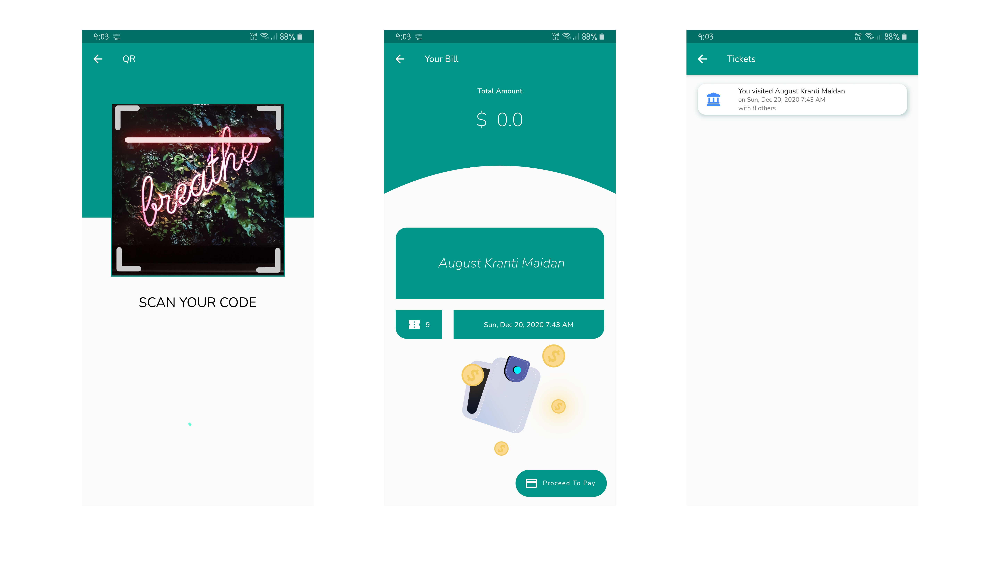

# Ghumakkad

## Project for Hackademic 

### App Features

- Live Count of number of visitors at the moment for every tourist place.
  So you can easily plan your trip accordingly.
- Unique contactless billing and ticket booking process.
- Information and reviews about Places.

### Future Plans

- Add Bluetooth billing method to start/stop billing whenever the user enters the proximity range in order to automate whole process
- List services available at tourist places (ex: restaurant) and provide special offer to those who use the app.
- Add payment gateway.
- Make the whole process more secure by adding functionality of Blacklisting user if he/she fails to successfully pay the fee.  
  
### Live Demo

You can check out the live demo of the app, on <a href='https://youtu.be/ZjTLvHjShh0'>Youtube</a>. 

### Screenshots

